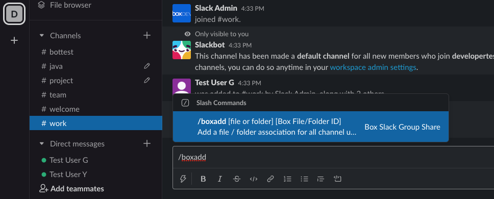

# Connect Slack to Box Group Collaborations

Slack is a popular communication and productivity tool, allowing for real-time
coordination when working with individuals or groups in and outside of the
company. 

When connected to a custom Box application, the Slack channel structure, along
with the [slash command][slack-slash-commands] and [event API][slack-event-api]
systems, may be used to provide a logical grouping and collaboration system for
Box files and folders.

## Overview

This quick start guide will walk through how to group Box users based on the
channels they are in within a Slack workspace, then permit individuals within
those Slack channels to share Box files and folders with the group with Slack
slash commands.

At the end of this tutorial we will have a Slack bot that will be deployed to a
channel in our workspace. This bot will create a Box group from all of the
people present in the channel, then listen for `/boxadd` slash commands in the
channel to collaborate Box files and folders from the user with the entire
group.

<ImageFrame noborder center shadow>
  
</ImageFrame>

This will take you through the following steps.

1. [Setup and configure your Slack app][step1] to set up the event notification
 and Slash command structures. 
1. [Setup and configure your Box application][step2] so that we connect the web
 application to Box. 
1. [Listen for Slack events and commands][step3] when users join and leave
 channels, or share Box files and folders with the group.
1. [Structure Box groups and file / folder collaborations][step4] based on the
 Slack events or slash commands. 
1. [And finally, deploy the application to your workspace][step5] and invite
 the Slack app bot to your channels to begin listening for events.

## Requirements

The quick start guide has two requirements around your Slack / Box setup, and
your application code.

1. **User emails need to match between Box and Slack**: Since we are connecting
 a Slack user account to a Box user account via the Slack user email address, a
 matching Box user account using the same email address must be present in the
 Box enterprise.
1. **You must have a publicly accessible server**: Slack will send event and
 command notification data to a public URL, where our application will be
 hosted. This guide assumes that you have a public location where your
 application code will be hosted, such as `https://mysite.com/`. If you don't
 have one, application platforms like [Heroku][heroku], serverless options
 like [AWS lambda][aws-lambda], or exposing localhost with services like
 [ngrok][ngrok] are all viable options.

<Next>
  I am ready to get started
</Next>

[slack-slash-commands]: https://api.slack.com/apps/A0155185TT3/slash-commands
[slack-event-api]: https://api.slack.com/events-api
[step1]: g://collaborations/connect-slack-to-group-collabs/configure-slack
[step2]: g://collaborations/connect-slack-to-group-collabs/configure-box
[step3]: g://collaborations/connect-slack-to-group-collabs/scaffold-application-code
[step4]: g://collaborations/connect-slack-to-group-collabs/handle-slack-events
[step5]: g://collaborations/connect-slack-to-group-collabs/connect-box-functions
[step6]: g://collaborations/connect-slack-to-group-collabs/test-bot
[heroku]: https://heroku.com/
[aws-lambda]: https://aws.amazon.com/lambda/
[ngrok]: https://ngrok.com/