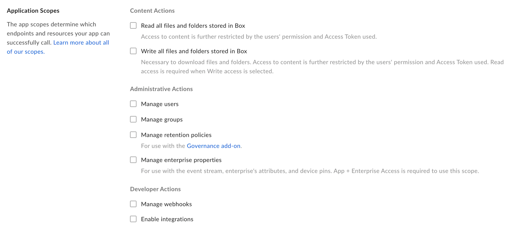

# Setup with OAuth 2.0

A Custom App can be set up to use client-side [OAuth 2.0][oauth2] authentication.

<CTA to='g://authentication/oauth2'>

Learn how OAuth 2.0 authentication works

</CTA>

## Prerequisites

To set up a Custom App using OAuth 2.0 authentication, you will need to ensure
you have access the [Developer Console][devconsole] from your Box enterprise
account. Alternatively, you may sign up for a [developer account][devaccount].

## App creation steps

### 1. Navigate to the Developer Console

Log into Box and navigate to the
[Developer Console][devconsole]. Select **Create New App**.

### 2. Select the type of application

Select **Custom App** from the list of application types. A modal will appear to
prompt a selection for the next step.

<ImageFrame border>

</ImageFrame>

### 3. Select the type of authentication and app name

Select **User Authentication (OAuth 2.0** and provide a unique name for your
application. Click **Create App**.

<ImageFrame border width="400" center>

</ImageFrame>

## Basic configuration

Before the application can be used, some additional, basic configuration is
required.

### Redirect URI

During the OAuth 2.0 flow, users are redirected to their browser to
authenticate and then authorize the application to take actions on their behalf.

Once successful, the user is redirected back to the configured redirect URI of
the application. This URI can be any secure HTTPS URL, or a less secure HTTP URL
for a server running on `localhost`.

<ImageFrame border width="600" center>

</ImageFrame>

### Application Scopes

Scopes define what permissions your application has in order to access data. See
the [scopes guide][scopes] for detailed information on each option.

<ImageFrame border width="600" center>

</ImageFrame>

### CORS Domains

If your application makes API calls from front-end browser code in
Javascript, the domain that these calls are made from will need to be
added to an allow-list due to [Cross Origin Resource Sharing][cors],
also known as CORS. If all requests will be made from server-side code,
you may skip this section.

To add the full URI(s) to the allow-list, navigate to the **CORS Domain**
section at the bottom of the **Configuration** tab in the
[Developer console][devconsole].

<ImageFrame border>

</ImageFrame>

[devconsole]: https://app.box.com/developers/console
[devaccount]: https://account.box.com/signup/n/developer
[devtoken]: g://authentication/access-tokens/developer-tokens
[scopes]: g://api-calls/permissions-and-errors/scopes
[cors]: https://en.wikipedia.org/wiki/Cross-origin_resource_sharing
[oauth2]: g://authentication/oauth2