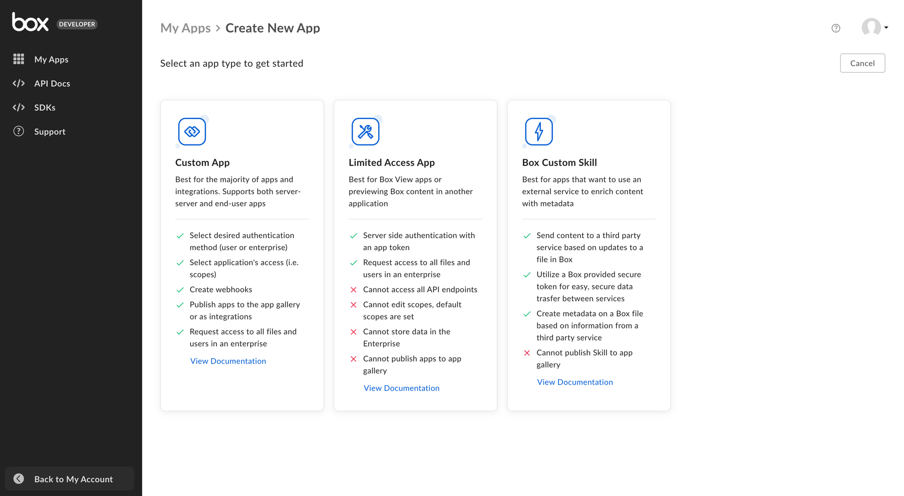

# Setup

Setting up a Custom Skill is a multi-step process.

## Prerequisites

To set up a Custom App using OAuth 2.0 authentication, you will need to ensure
you have access the [Developer Console][devconsole] from your Box enterprise
account. Alternatively, you may sign up for a [developer account][devaccount].

## App creation steps

### 1. Log in to the Developer Console

Log into Box and navigate to the
[Developer Console][devconsole]. Select **Create New App**.

### 2. Create a Custom Skill

Select **Box Custom Skill** option from the list of application types. A modal
will appear to prompt the next step.

<ImageFrame border>

</ImageFrame>

### 3. Provide a name

Finally, select a unique name for your application and click **Create App**.

<ImageFrame border width="600" center>

</ImageFrame>

## Approval

You must select a folder that will trigger your skill before you can start using
it.

<CTA to='g://authorization/custom-skill-approval'>

Learn more about approving Custom Skills

</CTA>

## Basic configuration

Before a Custom Skill can be enabled enabled on a folder, you must complete
some additional configuration.

### Invocation URL

For every file uploaded, copied, or moved into the selected folder, your skill
will send a payload to a remote URL. This URL is called the invocation URL.

The Invocation URL can be any HTTP endpoint representing a server, development
machine, or serverless function. The only requirement is that the URL is
publicly available and accessible by Box servers. For this reason, `localhost`
is not a valid address.

To set up the Invocation URL, navigate to the **Configuration** tab of the
[Developer Console][devconsole] and scroll down to the "Invocation URL" section.

<ImageFrame border width="600" center>

</ImageFrame>

Fill in a secure HTTPS address and save the form. The invocation URL is now
configured.

### File Extensions

By default a Custom Skill will trigger for any file type in the folder. To
specify only selected file extensions to trigger the skill, navigate to the
**Configuration** tab of the [Developer Console][devconsole] and scroll down to
the **File Extensions** section.

<ImageFrame border width="600" center>

</ImageFrame>

[devconsole]: https://app.box.com/developers/console
[devaccount]: https://account.box.com/signup/n/developer