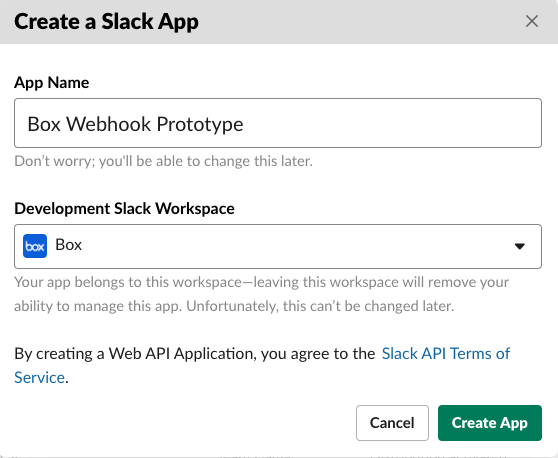
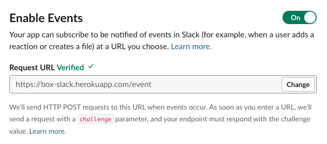

# Configure Slack

The first step in this guide is to create and configure a Slack application,
which will set up a Slack bot to listen for user events in Slack
channels, as well as respond to slash commands by users in those channels to
share Box files and folders with the group.

This section will walk you through several steps.

* Creating the bare Slack application.
* Configuring a `/boxadd` slash command to share Box files and folders with the
 channel group in Box.
* Configuring the Slack event listener to send notifications to our application
 whenever a user joins or leaves the channel, so that the Box group can be
 updated.

Choose your preferred language / framework below to get started.

<Grid columns='3'>

<Choose option='programming.platform' value='node' color='blue'>

# Node
Using the Express.js framework.

</Choose>

<Choose option='programming.platform' value='java' color='blue'>

# Java
Using the Spring Boot framework.

</Choose>

<Choose option='programming.platform' value='dotnet' color='blue'>

# .NET
Using the ASP.NET Core framework.

</Choose>

</Grid>

<Grid columns='3'>

<Choose option='programming.platform' value='python' color='blue'>

# Python
Using the Flask framework.

</Choose>

<Choose option='programming.platform' value='ruby' color='blue'>

# Ruby
Using the Sinatra framework.

</Choose>

</Grid>

## Create the app

Go to the [Slack apps page][slack-apps] and click **Create New App**. Add an
**App Name**, select your **Development Slack Workspace** from the dropdown
list where the application bot will be deployed to, then click **Create App**.

<ImageFrame noborder center shadow>



</ImageFrame>

Once created, you will be redirected to the basic information section of the
application. You may adjust the icon and description of your app within the
**Display Information** section at the bottom to customize the application
in your workspace.

## Configure the Slack app event listener

Where slash commands will allow Slack channel users to share Box content 
with everyone in the channel, the event listener will allow us to monitor for 
passive events within the channel. For this bot, we want to monitor three 
[Slack events][slack-events] to produce actions within Box.

* [`bot_added`][slack-event-bot-added]: When the bot is first added to a
 channel, it will get a list of all users in the channel, then create a
 Box group for those users. Content will be added to the group through the
 Slash commands.
* [`member_joined_channel`][slack-event-member-joined]: When a new Slack user
 joins a channel they will be added to the Box group.
* [`member_left_channel`][slack-event-member-left]: When a channel user leaves
 or is removed, they will be removed from the Box group.

To set up a notification URL to which new Slack event payloads will
be sent, Slack requires a verification step. When you set an event listener URL
for your bot application code, Slack will immediately send a challenge to that
URL to verify that it's valid. This will be an HTTP POST with a payload that
looks something like the following:

```javascript
{ 
  "token": "Jhj5dZrVaK7ZwHHjRyZWjbDl", 
  "challenge": "3eZbrw1aBm2rZgRNFdxV2595E9CY3gmdALWMmHkvFXO7tYXAYM8P",
  "type": "url_verification" 
}
```

To set up the URL for the event listener, that URL that is set needs
to respond with a verification payload containing the challenge value back to
Slack during this step. The payload will look similar to the following.

```javascript
HTTP 200 OK Content-type: application/json {"challenge":"3eZbrw1aBm2rZgRNFdxV2595E9CY3gmdALWMmHkvFXO7tYXAYM8P"}
```

Deploy the following code to your public endpoint.

<!-- markdownlint-disable line-length -->

<Choice option='programming.platform' value='node' color='none'>

```javascript
const express = require('express'); 
const app = express();
const port = process.env.PORT || 3000;

app.use(express.urlencoded({ extended: true }));
app.use(express.json());

app.post('/event', (req, res) => {
  if (
    req.body && 
    req.body.challenge && 
    req.body.type === 'url_verification'
  ) {
    res.send({ 
      challenge: req.body.challenge 
    });
  } else {
    res.status(400).send({ 
      error: "Unrecognized request"
    });
  }
});

app.listen(port, function(err) { 
  console.log("Server listening on PORT", port); 
});
```

</Choice>

<Choice option='programming.platform' value='java' color='none'>

```java

```

</Choice>

<Choice option='programming.platform' value='dotnet' color='none'>

```dotnet

```

</Choice>

<Choice option='programming.platform' value='python' color='none'>

```python

```

</Choice>

<Choice option='programming.platform' value='ruby' color='none'>

```ruby

```

</Choice>

<Choice option='programming.platform' unset color='none'>

<Message danger>

# Incomplete previous step
Please select a preferred language / framework above to get started.

</Message>

</Choice>

<!-- markdownlint-enable line-length -->

Now that we have the code to respond to the Slack challenge when adding an
event URL, we can configure that within the Slack application.

From your Slack application **Basic Information** tab, under
**Add features and functionality**, click on the button titled
**Event Subscriptions** and do the following.

* Toggle **Enable Events** to **On**.
* Under **Request URL** add in the public URL that you deployed the above code
 to, and be aware that we are listening at `{APPROUTE}/event` (such as
 `https://myapp.com/event`). Once you add the URL and click outside the field,
 Slack will immediately send the challenge to the URL that you were hosting the
 code at above. If the code responds correctly, you will see a green verified
 note beside the **Request URL** header.

<ImageFrame noborder center shadow>



</ImageFrame>

* Expand the **Subscribe to bot events** section and click on the
 **Add Bot User Event** button.
* Add `member_joined_channel` and `member_left_channel` to the events the bot
 is subscribed to. These will send events when anyone new is added to the
 channel.
* Click the **Save Changes** button at the bottom of the page.

## Configure the Slack app slash command

To associate files or folders in Box with the Slack channels, we can use Slack
slash commands. This will allow any person in the channel to share content they
own in Box with the rest of the channel through a manually input command.

Through this command, a channel member will be able to type
`/boxadd [file / folder] [id]`, such as `boxadd file 1459732312`, into the
channel to share the file / folder with the channel using Box groups and
collaborations.

From the **Basic Information** tab of your application, under **Add features and
functionality**, click on the button titled **Slash Commands**. 

In the page that comes up, click **Create New Command** and input the following:

* Command: This is the command that a channel user will use to share
 a Box file / folder ID with the channel. Use `/boxadd` for this quick start.
* Request URL: The URL that is listening for and responding to slash
 commands in our Slack bot. In this quick start we use the same event URL that
 was used for the app event listener section above.
* Short Description: A description of what the Slash command will do.
* Usage Hint: Additional parameters that may be passed to the command. In 
 our case, that's the Box file / folder ID and type of content.

<ImageFrame noborder center shadow>


</ImageFrame>

Click **Save** to add the command to our Slack app.

## Add Remaining Scopes

When slash commands or notifications are sent to our application from
Slack they will contain a Slack user ID, which relates to the person that took
or was affected by the action. To translate that ID to Box, we need to get the
Slack user email, which will be how we associate Slack users to Box users. That
requires two extra scopes in the Slack application.

From your Slack application configuration, click on **OAuth & Permissions** in
the left menu, then do the following.

* Scroll down to the **Scopes** section.
* Click on the **Add an OAuth Scope** button under **Bot Token Scopes**..
* Search for and add `users:read` and `users:read.email`.

## Deploy Bot to Slack Workspace

The last step is to install the application into your Slack workspace. From the
**Basic Information** page of the app, expand the
**Install your app to your workspace** section.

<ImageFrame noborder center shadow>


</ImageFrame>

Click the button to **Install App to Workspace**.

<ImageFrame noborder center shadow>


</ImageFrame>

Once the **Allow** button is clicked you should see a success message. Your bot
is now installed within the workplace.

## Summary

* You've created your Slack application.
* You've configured user event notifications, slash commands, and additional
  scoping.
* You've deployed your Slack bot to your workspace.

<Observe option='programming.platform' value='node,java,python,dotnet,ruby'>

<Next>

I have my local application set up

</Next>

</Observe>

[slack-apps]: https://api.slack.com/apps
[slack-events]: https://api.slack.com/events
[slack-event-bot-added]: https://api.slack.com/events/bot_added
[slack-event-member-joined]: https://api.slack.com/events/member_joined_channel
[slack-event-member-left]: https://api.slack.com/events/member_left_channel
[step3]: g://collaborations/connect-slack-to-group-collabs/scaffold-application-code