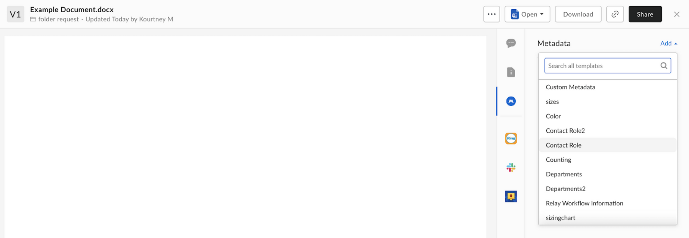
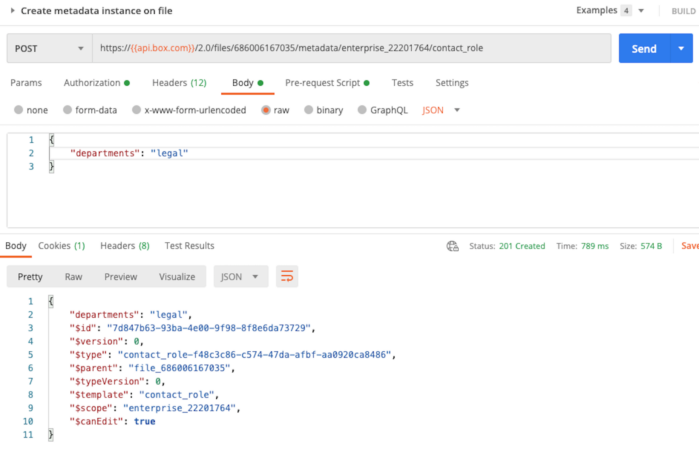

# Add Metadata Template to a File

Your metadata template needs to be applied to at least one file to ensure
a result in step 4. There are two ways to do add a metadata template to a file:
via the UI or via the API.

## UI

To apply metadata to a file using the UI, navigate to a file and open the
preview. Use the **Metadata** tab and click **Add**. Find the metadata template
created in step 1 and select a value. Ensure you click **Save**.

<ImageFrame center>

</ImageFrame>

## API

To add a metadata template to a file you will need to use the
[create metadata instance on a file endpoint][add-metadata]. You will also
need the `scope` and `templateKey` template values from the previous step.
Below is an example of what the API call looks like to apply the same metadata
shown in the UI above.

<ImageFrame center>

</ImageFrame>

<Next>

I applied my template to at least one file

</Next>

[add-metadata]: e://post-files-id-metadata-id-id/