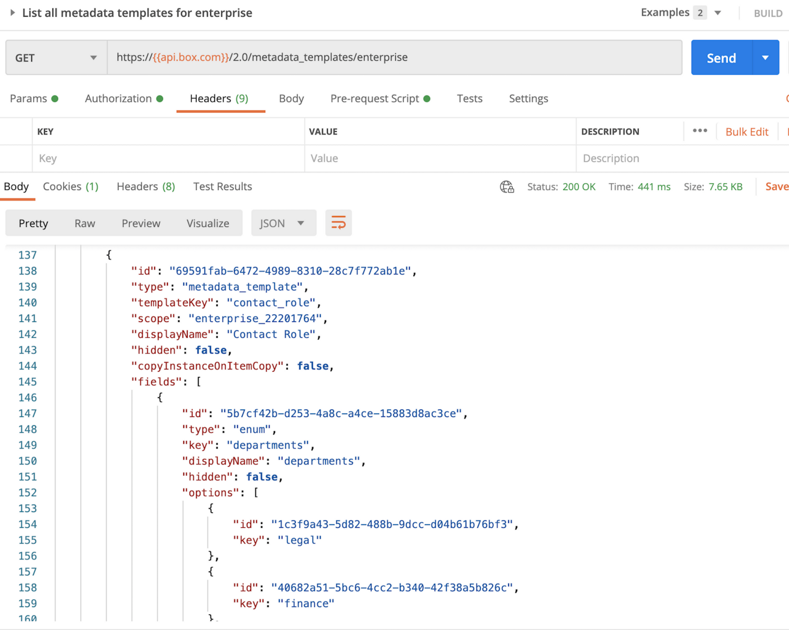

# Locate Information about a Metadata Template

<Message warning>

If you created your metadata template using the API and have the successful
response on hand, you can skip this step.

</Message>

If you created your metadata template via the Admin Console, you will need
obtain an [Access Token][at] for an Admin or Co-Admin with permission to
**Create and edit metadata templates for your company**. As mentioned in
step 1, the easiest way to obtain a token meeting these requirements is to log
in as an Admin or Co-Admin, pull up the application in the
[Developer Console][dc], and click **Generate Developer Token** under the
**Configuration** tab. 

Use this token to make an API call to the
[list all metadata templates for enterprise endpoint][metadata-list], as shown
below. You should be able to find information about your template in the
response. Specifically, note the `scope` and `templateKey`. 

<ImageFrame center>

</ImageFrame>

<Next>

I obtained the details about my template

</Next>

[at]: g://authentication/access-tokens/
[dc]: https://account.box.com/developers/console
[metadata-list]: e://get-metadata-templates-enterprise/