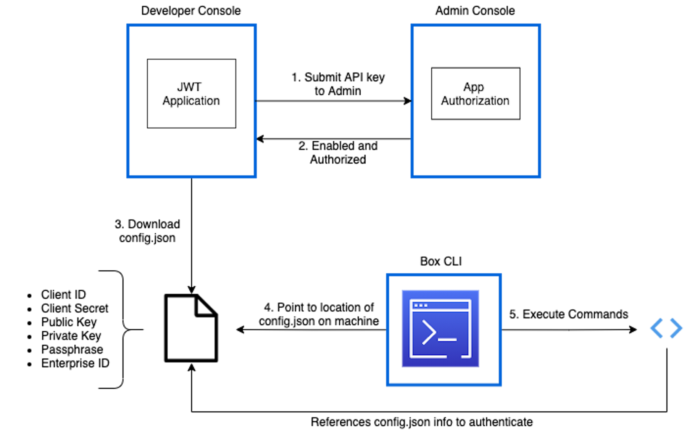

# CLI configuration

<ImageFrame center>

</ImageFrame>

## Download configuration file

The CLI needs to be configured to point to a configuration file so that it can
[authenticate][auth] and then make API calls as the authenticated user. By
default the CLI will always authenticate as the JWT application’s
[Service Account][sa].

To download the configuration file, visit the configuration tab in the
[Developer Console][dc] for the JWT application created in step 1.
Click **Generate a Public/Private Keypair**, which will automatically start the
download.

<Message warning>

For security reasons 2FA must be enabled on your Box account to successfully
generate a public/private keypair.

</Message>

## Rename and move configuration file

Locate the downloaded file on your machine which has a default name in the
format: `EnterpriseID_publicKeyID_config.json`. You may leave this name or
choose to rename it. This guide assumes the file is renamed to `config.json`.

<Message warning>

It is critical you place the file to a location where it will not be
inadvertently deleted or moved. If this occurs you will need to repeat the
steps below to reconfigure the CLI to point to the file.

</Message>

## Run configuration command

Then, open the terminal or command line and type the command:

`box configure:environments:add PathToConfigFileHere`

For example:
`box configure:environments:add /Users/ExampleUser/Documents/CLI/config.json`

<Message type=tip>

You can drag the file from your machine to the terminal/command line window
to auto-populate the path for you.

</Message>

## Summary

* You configured the CLI to point to the JWT application created in step 1

<Next>

I configured the CLI to point to my configuration file

</Next>

[auth]: g://authentication/jwt/without-sdk/
[sa]: g://authentication/user-types/service-account/
[dc]: https://app.box.com/developers/console